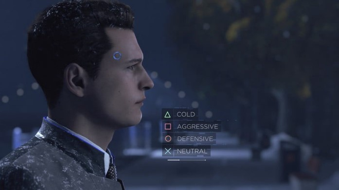
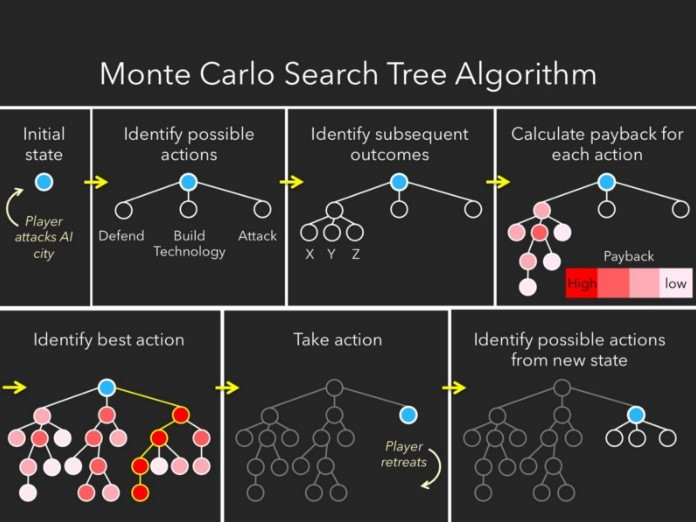

# Artificial Intelligence in videogames

## What is Aritificial Intelligence in videogames?
Usually the common thinking of "Artificial Intelligence" makes us very distant from the concept of videogames: indeed there are multiple meaninag of Artificial Intelligence, yet it is possible (and very common, actually) to talk about Artificial Intelligence in videogames. 
Two quite basically examples are:
- *Assisting gameplay*: such as the position of the enemies on the map
- *Non Playable Characters (NPC)*: such as the partners that guide us, or helps us, during the game (a very NPC I personally enjoy is Atreus in God of War).

It is possible to list a quite long list of video-games that use Artificial Intelligence in different ways, some examples may be:
- Detroit Become Human
- Red Dead Redemption, both 1 and 2
- Halo (Cortana is actually dedicated to the character in the videogame!)
- Monster Hunters
- Until Dawn
- Cyberpunk 2077
-…and many more!

Yet, most of them use a different concept of Artificial Intelligence

## The importance of Artificial Intelligence in Videogames
Videogames, with AI, are able to provide a better experience for the user an to their games itself. 

A game with a type of Artificial Intelligence that I particularly appreciated was "Detroit: Become Human"
<figure>

<figcaption align = "center"><b>Image Credits: IGN</b></figcaption>
</figure>

In this game we play three different characters: all of them are robots that have to make choices. Every choice that we do, will change inevitably the story, including the different characters. 

A quite similar game is "Until Dawn". We also play different characters and the multiple choices are presented to us with the name of "butterfly effect", here too every choice can make a huge difference on the game history.

But, in these cases, how the AI can be realized? Game AI often amounts to pathfinding and finite states machines in a form of tree. 

Pathfinding gets the AI from point A to point B, so for example if we make a choice in Until Dawn, we may be redirected to a different tree, instead of a desired one. This method is called **Monte Carlo Search Tree Algorithm**:

Above, an example of MCST.

Let us now talk about the **NPCs**, that would be the non playable character during the game (such as the character that walk with us and help us). There are four potential application areas:

1. Player-experience modeling: an example may be the dynamic game difficult: if we play "easy mode" the NPCs may do all the work (if it is our ally) or basically do some slow and predictable movements (if it is our enemy).
2. Procedural-content generation: levels, music, conditions are created in an automated way. So, the AI can generate differents levels, different content, different stories. An example may be "Cyberpunk 2077"; at the start of the game you can choose between three different backgrounds, each one will lead to a different story.
3. Data mining on user behavior: mostly for the exploration game (so, open-world).
4. Alternate approaches to NPCs: in this approach, it is more important the beliavility of the NPC (such as understanding if someone is lying to us, or it can be trusted) instead of the individual behavior.

For these, we don't follow procedural approaches, yet **generative adversarial networks (GANs)** can be used to create new content. These types of networks will understand during the game and act depending on our behaviour.
