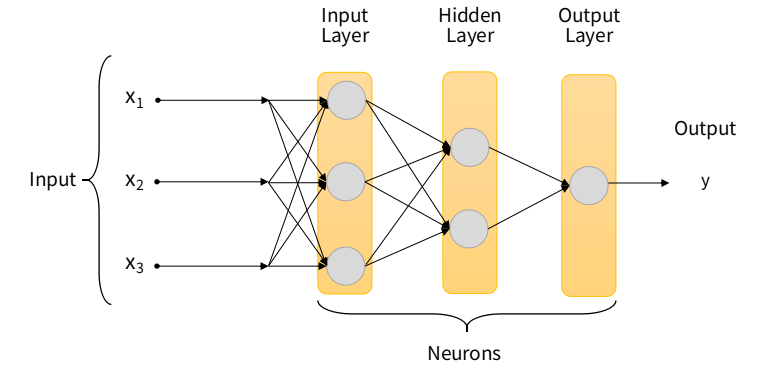

# Introduzione e primi passi nel Deep Learning

## Deep Learning

Il **Deep Learning** (o apprendimento approfondito) è il ramo più profondo dell'**Intelligenza Artificiale** e la sottocategoria del **Machine Learning**.
Consiste in un insieme di tecniche che utilizzano **reti neurali artificiali** per simulare il cervello umano e la sua possibilità di inviare impulsi elettrici, generando "decisioni".

## Come funziona il Deep Learning?

Il **Deep Learning** è una rete neurale con tanti **livelli** (o strati). Ognuno di questi processa le informazioni e consegna la sua elaborazione ai neuroni che seguono, i quali a loro volta processeranno queste elaborazioni via via, fino ad arrivare allo strato finale. Pochi livelli riescono a modellare un problema semplice, mentre più livelli sono necessari per risolvere problemi più complessi, dove per complessità ci si riferisce ai dati utilizzati dalla rete neurale: dati complessi sta a identificare dati che hanno molte caratteristiche, diverse tutte tra loro, mentre nel caso di dati semplici ci si riferisce a quelli che hanno poche caratteristiche. Pensiamo alla classificazione di transazioni fraudolente, dove i dati sono formati da caratteristiche e informazioni di ogni cliente. Le informazioni di ogni cliente riguardano i dati personali, le sue transazioni, le offerte o tariffe, insomma ogni cliente genera un gran quantitativo di informazioni che richiederebbe un numero di livelli enorme. 

Il **Deep Learning** ha iniziato ad essere largamente utilizzato grazie all'avanzamento tecnologico a cui abbiamo assistito negli scorsi anni, quando sono stati generati grandi quantità di **dati** e i processori, ma anche tutti gli strumenti di calcolo, sono diventati sempre più in grado di gestire moli di dati. Tutto ciò permette ad una rete di essere addestrata a risolvere problemi di **apprendimento automatico**, senza sistemazione preventiva dei dati, come avviene nel **Machine Learning**.

## Che differenza c'è tra il Machine Learning o Deep Learning?

Prendiamo come esempio la **classificazione di fotografie** di cani o gatti. Vogliamo che vengano riconosciute tutte le immagini raffiguranti i gatti e i cani. Le tecniche del **Deep Learning**, ****che si basano sull'utilizzo delle **reti neurali**, ****possono determinare quali sono le caratteristiche che li contraddistinguono maggiormente come le orecchie, il muso, ecc. Nel Machine Learning l’estrazione delle caratteristiche deve essere fatta manualmente.

Quindi la diversità non sta nel risultato finale, ma nella tecnica utilizzata e nella tipologia di dati di partenza. Inoltre il deep learning permette di modellare, anche per questo motivo, problemi anche molto complessi, gestendo la complessità con il numero di strati e neuroni.

## Applicazioni del Deep Learning

Le applicazioni del **Deep Learning** sono vastissime ma possiamo citarne alcune tra le più conosciute:

- **elaborazione del linguaggio naturale** (riconoscimento di intenti, traduzione, generazione di risposte intelligenti, …)
- **elaborazione di immagini** (classificazione, segmentazione, riconoscimenti di oggetti, generazione di immagini artificiali)
- **analisi predittive su serie temporali** (previsione delle vendite, previsioni di stock finanziari, …)

**Referenze:** 

- IBM cloud education, [Machine Learning](https://www.ibm.com/cloud/learn/machine-learning), IBM, 2020

**Immagini:** 

- [https://www.innovationpost.it/wp-content/uploads/2022/03/deep-learning.jpg](https://www.innovationpost.it/wp-content/uploads/2022/03/deep-learning.jpg)
- [https://i0.wp.com/semiengineering.com/wp-content/uploads/2018/01/MLvsDL.png?ssl=1](https://i0.wp.com/semiengineering.com/wp-content/uploads/2018/01/MLvsDL.png?ssl=1)