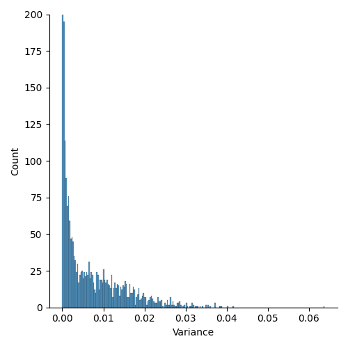
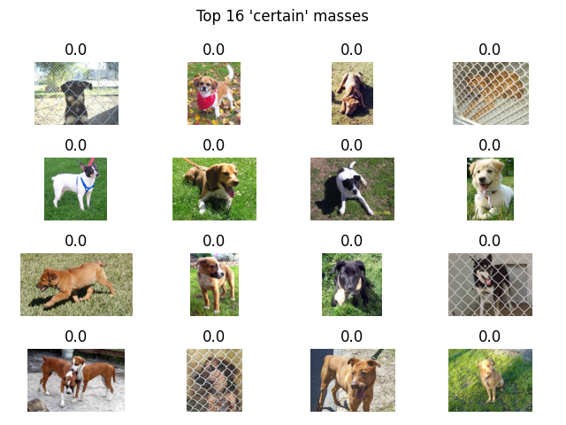
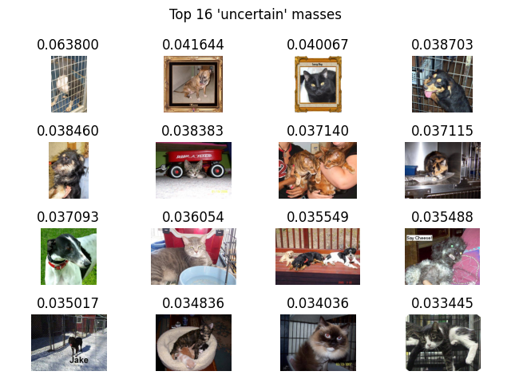

# Model uncertainty through Monte Carlo dropout - PT2
This small series of blog-posts aims to explain and illustrate the Monte Carlo Dropout for evaluating the model uncertainty. The [first part](./../model-uncertainty-through-monte-carlo-dropout-pt1/Model%20uncertainty%20through%20Monte%20Carlo%20dropout%20-%20PT1.md) will investigate the model uncertainty in Deep Learning and how it can be hadled, inspecting pros and cons of different approaches. Then, this second part explains, step by step, the pipeline of a practical project (with [code](https://github.com/francescodisalvo05/monte-carlo-dropout)) in PyTorch. I hope you'll enjoy them!

## Brief recap of Monte Carlo Dropout
Long story short, the uncertainty in Deep Learning is typically modeled through Bayesian Networks, where every parameter of the network is not a scalar anymore but it a **distribution**. Therefore our **predictive distribution** will leverage all possible parameter settings weighted with their probabilities. This is of course extremely expensive, therefore this is barely applied, especially with deep networks, hence with millions or billions of parameters.

An approximation of the bayesian inference is given by the Monte Carlo dropout. Making inference on the same dataset $N$ times with dropout activated was proved to be equivalent to **drawing samples from a posterior distribution**.

Starting from these $N$ slightly different results, called **Monte Carlo samples**, it is possible to estimate the uncertainty through some handcrafted metrics.

If you missed something, feel free to go back on the [first part](./../model-uncertainty-through-monte-carlo-dropout-pt1/Model%20uncertainty%20through%20Monte%20Carlo%20dropout%20-%20PT1.md) and come back here whenever you're ready.

## Seed
During my first Machine Learning experiments a couple of years ago I spent probably two intense days trying to figuring out why model was not providing deterministic outcomes. Then, I realized it was due to the the **seed**. For the people that do not know what the seed is, this is a number (or vector) that is used for initializing a pseudorandom number generator, and if you do not fix it, it will change at every run. 

Then I found the script below for fixing all the possible seeds within my pipeline. Unfortunately I cannot find the original source, but I just copy paste it between all my projects.

```python
import torch
import numpy as np
import os
import random


def set_seed(seed):
    torch.manual_seed(seed)
    torch.cuda.manual_seed_all(seed)
    torch.backends.cudnn.deterministic = True
    torch.backends.cudnn.benchmark = False
    np.random.seed(seed)
    random.seed(seed)
    os.environ['PYTHONHASHSEED'] = str(seed)
```

## Dataset
For this experiment we used the [dogs-vs-cats](https://www.kaggle.com/competitions/dogs-vs-cats/data?select=train.zip) dataset on Kaggle. The training set (available with labels) contains $25,000$ images of dogs and cats. This is a balanced dataset, therefore there are $12,500$ images for each class.

Since the test set had no labels, we used the available training set as training, validation and test set. To do so, keeping the same class proportions, we divided this dataset in three independent parts:
* Training : $15,000$ training samples
* Validation : $5,000$ validation samples
* Test: $5,000$ test samples

As every PyTorch project, we have to define our class Dataset and the relative dataloaders. Each filename contains the class like `cat.0.jpg`, but in order to make our samples (train/val/test) **stratified** (i.e. proportioned), we need to define our manual labels that will be leveraged by scikit-learn's **train_test_split**.

First thing first, we defined our **Dataset** class, which requires the root path of the images, the filenames and optionally, a transformation operation (like resize and so on).

Notice that we will refer to class $1$ for dogs and class $0$ for cats.

```python
class Dataset:

    def __init__(self, root_path, filenames, transform = None):
        """
        :param root_path: (str) path of the root folder containing all the available images
        :param filenames: (list) filenames involved on the current dataset split (train/val/test)
        :param labels: (list) labels involved on the current dataset split (train/val/test)
        :param transform: (transform) data transformation pipeline
        """
        self.root_path = root_path
        self.filenames = filenames
        self.transform = transform

    def __len__(self):
        return len(self.filenames)

    def __getitem__(self, idx):
        """Return the couple (image,label). Let us assume that class 1 is for "dog" and class 0 is cat.
        There is no particular reason, I just prefer dogs :D (just kidding)
        """

        filepath = os.path.join(self.root_path,self.filenames[idx])

        # filenames are in the form "cat.0.jpg"
        # therefore let's pick the token before the first dot
        label_str = self.filenames[idx].split(".")[0]
        # consider the dog as class 1
        label = 1 if label_str == 'dog' else 0

        # read image as a numpy array
        img = np.array(Image.open(filepath))

        if self.transform:
            img = self.transform(img)

        return img,label
```

## Dataloaders

After that, we need to get our trainining, validation and test **dataloaders**, as follows. 

```python
from sklearn.model_selection import train_test_split
from torch.utils.data import DataLoader

from data.dataset import Dataset

import os


def get_dataloaders(root_path, batch_size, transform):

    filenames = os.listdir(root_path)
    labels = [1 if f.split(".")[0] == 'dog' else 0 for f in filenames]

    x_trainval, x_test, y_trainval, y_test = train_test_split(filenames, labels, stratify=labels, test_size=0.2)
    x_train, x_val, y_train, y_val = train_test_split(x_trainval, y_trainval, stratify=y_trainval, test_size=0.25)

    train_ds = Dataset(root_path, x_train, transform)
    val_ds = Dataset(root_path, x_val, transform)
    test_ds = Dataset(root_path, x_test, transform)

    train_loader = DataLoader(train_ds, batch_size=batch_size, shuffle=True, drop_last=True)
    val_loader = DataLoader(val_ds, batch_size=batch_size, shuffle=True, drop_last=True)
    test_loader = DataLoader(test_ds, batch_size=1, shuffle=False)

    return train_loader, val_loader, test_loader
```

## Model
Our goal was not to maximize the model performances, but to leverage the Monte Carlo dropout. Therefore instead of starting from some pre-trained ResNets and fine tune them on the current dataset, let's define a simple **Four-layers CNN**, with a **final dropout** before the linear layer. Each layer presents convolution, batch normalization, relu and a final pooling layer. Here of course the dropout is necessary in order to leverage the Monte Carlo dropout, you can also add more dropout or increase the dropout probability and see what happens! 

```python
import torch.nn as nn

class CNN(nn.Module):
    def __init__(self):
        super(CNN, self).__init__()

        # layer 1
        self.conv1 = nn.Conv2d(3, 16, kernel_size=(3,3), bias=False)
        self.bn1 = nn.BatchNorm2d(16)
        self.relu1 = nn.ReLU()
        self.pool1 = nn.MaxPool2d(kernel_size=(2, 2))

        # layer 2
        self.conv2 = nn.Conv2d(16, 32, kernel_size=(3, 3), bias=False)
        self.bn2 = nn.BatchNorm2d(32)
        self.relu2 = nn.ReLU()
        self.pool2 = nn.MaxPool2d(kernel_size=(2, 2))

        # layer 3
        self.conv3 = nn.Conv2d(32, 32, kernel_size=(5, 5), bias=False)
        self.bn3 = nn.BatchNorm2d(32)
        self.relu3 = nn.ReLU()
        self.pool3 = nn.MaxPool2d(kernel_size=(2, 2))

        # layer 4
        self.conv4 = nn.Conv2d(32, 64, kernel_size=(3, 3), bias=False)
        self.bn4 = nn.BatchNorm2d(64)
        self.relu4 = nn.ReLU()
        self.pool4 = nn.MaxPool2d(kernel_size=(2, 2))

        # dropout
        self.dropout1 = nn.Dropout(0.2)

        self.fc1 = nn.Linear(64*13*13, 2)
        self.sig1 = nn.Sigmoid()

    def forward(self, x, train=True):

        # layer 1
        x = self.pool1(self.relu1(self.bn1(self.conv1(x))))
        # layer 2
        x = self.pool2(self.relu2(self.bn2(self.conv2(x))))
        # layer 3
        x = self.pool3(self.relu3(self.bn3(self.conv3(x))))
        # layer 4
        x = self.pool4(self.relu4(self.bn4(self.conv4(x))))
        # dropout
        x = self.dropout1(x)

        if train:
            x = x.view(32, -1)
        else:
            x = x.view(1, -1)

        x = self.sig1(self.fc1(x))

        return x
```

## Trainer
Once we define the model, we are ready for the definition of the **Trainer** class, which will manage the training and validation pipeline. Keep in mind for later that on our pipeline during the training step we define model.train() which activated dropout and batch normalization whereas in validation and test we use model.eval() which switches off the dropout and batch normalization layers. This is where we have to act in order to modify our Monte Carlo inference.

```python
import os
import numpy as np

import torch

from datetime import datetime

class Trainer:

    def __init__(self, optimizer, criterion, output_path, device):

        self.optimizer = optimizer
        self.criterion = criterion
        self.output_path = output_path
        self.device = device

    def train(self, model, train_loader, epoch):

        train_loss, correct = 0.0, 0
        model = model.float().to(self.device)

        model.train()

        print(f"\nEpoch {epoch+1}")

        for idx, (images,labels) in enumerate(train_loader):

            images, labels = images.to(self.device), labels.to(self.device)

            self.optimizer.zero_grad()

            outputs = model(images.float())

            loss = self.criterion(outputs,labels)
            train_loss += loss.item()

            _, predicted = torch.max(outputs.data, 1)
            correct += torch.sum(labels == predicted).item()

            loss.backward()
            self.optimizer.step()

        avg_loss = train_loss / (idx + 1)
        accuracy = 100. * correct / len(train_loader.dataset)

        return avg_loss, accuracy

    def validate(self, model, val_loader):

        val_loss, correct = 0.0, 0
        model = model.float().to(self.device)
        model.eval()

        with torch.no_grad():
            for idx, (images, labels) in enumerate(val_loader):

                images, labels = images.to(self.device), labels.to(self.device)

                outputs = model(images.float())
                val_loss += self.criterion(outputs, labels).item()
                _, predicted = torch.max(outputs.data, 1)
                correct += torch.sum(labels == predicted).item()

        avg_loss = val_loss / (idx + 1)
        accuracy = 100. * correct / len(val_loader.dataset)

        return avg_loss, accuracy
```

## Training and inferences
The previous snippet of codes are the main building blocks of our pipeline. So, once everything is ready we can start to train and fine tune the model in order to obtain satisfactory performances.

After an adequate fine tuning of the parameters, an Adam optimizer was chosen, with a learning rate of $0.0001$. On the other hand, the selected loss was the Cross Entropy.

I will not report the training and inference pipeline otherwise this blogpost will be longer than expected, but you can easily take them [here](https://github.com/francescodisalvo05/monte-carlo-dropout/blob/main/train.py) and [here](https://github.com/francescodisalvo05/monte-carlo-dropout/blob/main/inference.py), respectively. 

However, the best model achieved an accuracy of $0.80$ ($4014/5000$). This was a standard inference (i.e. with dropout deactivated), we will see in a minute how to handle the Monte Carlo dropout.

## Monte Carlo pipeline
The full pipeline and relatives arguments can be taken from [here](https://github.com/francescodisalvo05/monte-carlo-dropout/blob/main/mc_dropout.py). In this blogpost I will report only the central body of the main method.

Once the test_loader was taken, we are ready to make our $50$ inferences with dropout activated. Then, we'll store all these results and finally an handcrafted metric will estimate somehow the model uncertainty.

These are the main methods:

```python
# -- MAKE INFERENCE AND STORE PREDICTIONS ON DISK -- #
monte_carlo_inferences(args, test_loader, model, device)

# -- EXTRACT STATISTICS (MEAN/VAR) ACROSS MONTE CARLO SAMPLES -- #
store_monte_carlo_statistics(args)

# -- GET AVERAGE ACCURACY -- #
get_average_accuracy(args)

# -- PLOT Y-CASTED HISTPLOT -- #
get_std_histplot(args)

# -- GET EXAMPLE OF CERTAIN / UNCERTAIN MASSES -- #
plot_examples(args)
```

Let's see dome one by one.

### Monte Carlo inference

First of all, we have to **load the model's checkpoint**, that we obtained before. Then, we do not need to put our model in .train() mode because otherwise we will have to deal also with the batch-normalization layers. Therefore, we have to iterate over all model modules and to put in .train() mode only the ones that **start with Dropout**.

Then, we make inference $50$ times and we store all the "dog" raw probabilities (i.e. probability of class $1$) on disk.

```python
def monte_carlo_inferences(args, test_loader, model, device):

    # load model state dict
    model.load_state_dict(torch.load(args.model_path, map_location=device))

    # enable dropout at test time
    def enable_dropout(m):
        for each_module in m.modules():
            if each_module.__class__.__name__.startswith('Dropout'):
                each_module.train()

    model.eval()
    enable_dropout(model)

    # --- INFERENCE --- #
    for inference_idx in range(1,args.num_inferences + 1):

        labels, predictions, pos_probabilities = [], [], []

        for idx, (image,label) in enumerate(test_loader):

            image, label = image.to(device), label.to(device)

            output = model(image, train=False)
            output_max_idx = np.argmax(output.cpu().detach().numpy()[0])

            predictions.append(output_max_idx)
            labels.append(label.cpu().detach().numpy()[0])
            pos_probabilities.append(output.cpu().detach().numpy().squeeze()[1])

        labels = np.asarray(labels)
        predictions = np.asarray(predictions)
        pos_probabilities = np.asarray(pos_probabilities)

        print(f'#{str(inference_idx).zfill(2)} Test accuracy {np.sum(labels == predictions)}/{len(predictions)} : {np.sum(labels == predictions)/len(predictions):.2f}')

        # --- WRITE OUTCOMES ON DISK --- #
        with open(os.path.join(args.output_path,f'output_{str(inference_idx).zfill(2)}.txt'), 'w') as out_file:
            # they have the same prediction order
            filenames = test_loader.dataset.filenames
            for f, p, l in zip(filenames, pos_probabilities, labels):
                line = f'{f},{p},{l}\n'
                out_file.write(line)
```

### Statistics

Now, we aggregate all stochastic results, namely Monte Carlo samples in order to take the **variance** between all these probabilities for the same images. 

Here the variance will measure the spread of the probabilities for a given image. Ideally, we may assume that a **low variance** may reflect a kind of "low uncertainty" because the model is more likely to produce comparable results even with different model configurations (due to the dropout). On the other hand, an **high variance** may reflect a kind of "high uncertainty" because the model apparently produces different results with slightly different model configurations.

Finally, another final benchmark can be given by the **accuracy on the average probabilities** between the Monte Carlo samples. This can be considered as an ensemble, like Random Forest which aggregates many Decision Trees (more or less, this is just an example).

Therefore for every mass we stored on `monte_carlo_statistics.txt` the filename, average and variance between the Monte Carlo samples and finally, the correct label.

```python

def store_monte_carlo_statistics(args):

    monte_carlo_files = os.listdir(args.output_path)

    # store them in the following way:
    # { 'cat.1.jpg : [prob1, prob2, ..., prob50}
    filename_probabilities = defaultdict(list)
    labels = []  # they will have the same order

    # remove all unnecessary files
    monte_carlo_files = [f for f in monte_carlo_files if f.split(".")[-1] == "txt"]

    # get all "dog" probabilities across each monte carlo samples for every test mass
    for idx, monte_carlo_file in enumerate(monte_carlo_files):
        with open(os.path.join(args.output_path, monte_carlo_file), 'r') as curr_file:
            for line in curr_file.readlines():
                f, p, l = line.strip().split(",")
                filename_probabilities[f].append(float(p))

                if idx == 0:
                    labels.append(int(l))

    # get average and variance probabilities
    average_probabilities, variance_probabilities = [], []
    filenames = list(filename_probabilities.keys())
    for idx, filename in enumerate(filenames):
        average_probabilities.append(np.mean(filename_probabilities[filename]))
        variance_probabilities.append(np.var(filename_probabilities[filename]))

    # store filename, average, variance and label -> they will be leveraged for studying the
    # correlation between uncertainty and performances
    with open(os.path.join(args.uncertainty_path, 'monte_carlo_statistics.txt'), 'w') as curr_file:

        for filename, average, variance, label in zip(filenames,
                                                      average_probabilities,
                                                      variance_probabilities,
                                                      labels):
            line = f'{filename},{average},{variance},{label}\n'
            curr_file.write(line)
```

### Variance
Then, with all our statistics ready, we can see through an **histplot** how the variance spread across all our images. In the figure below it is possible to observe that, as expected, most of the masses have a really low variance. Obviously, I cropped the y-axis to $200$ for visualization reasons.

```python
def get_std_histplot(args):

    variances = []

    with open(os.path.join(args.uncertainty_path, 'monte_carlo_statistics.txt'), 'r') as curr_file:
        for line in curr_file.readlines():
            _, _, v, _ = line.strip().split(",")
            variances.append(float(v))

    sns.displot(x=variances)
    plt.ylim((0,200))
    plt.xlabel('Variance')

    plt.tight_layout()
    plt.savefig(os.path.join(args.uncertainty_path,'hist.png'))
```



This is probably due to two main factors: the dataset is not that difficult and there was only one dropout, with a low probability.

Therefore, further experiments may involve more than one dropout and/or a slightly higher probability. But keep in mind, that if you increase this probability too much, the performances may drastically decrease. 

### Example of low and high variance images
Finally, I was curios to see how these images looked like, based on their variance, a.k.a. the selected uncertainty metric. Ideally, an high variance should reflect an high uncertainty of the model towards the selected image, and vice versa.

Therefore, below I reported the top 16 images for both categories, namely "certain" and "uncertain", with the relative variance as title. 

|Low variance|High variance|
|:----:|:-------------:|
| |  |

Can we draw further assumptions based on these samples? Well, probably not. We probably need to investigate more in depth the images in order to spot some interesting pattern. 

### And now?
Fair point. Once we estimated the uncertainty of these outcomes, what can we do? Well, the sky is only the limit. However, while researching on the topic of my Master Thesis, the main proposal (from my [supervisor](https://scholar.google.com/citations?user=C6l5Es8AAAAJ&hl=en)) was to leverage this information at **inference time** in order to exclude the "uncertain" masses from the automatic pipeline. 

Since we were working on tumor segmentation and classification, it makes sense to be extremely careful with these outcomes. Therefore, we were able to provide mainly "certain" outcomes, improving the performances.

In fact, we proved that an high model uncertainty was correlated with a lower segmentation and classification performances! Cool, right?

> I will post the Master Thesis or the published paper when they will be publicly available!


## Conclusions
First of all, if you arrived here, you're a brave man, congratulations! Thank you for reading the post(s) so far.

After this series of blog posts regarding the Monte Carlo dropout, I hope you understood the limits of Bayesian inference and the potentiality of the Monte Carlo dropout. 

Moreover, despite the "simple" example, the pipeline will be always the same, therefore feel free to fork the repository and to make your own trials, with different datasets, models and metrics. I would love to see further results or ideas :D

To me, this is such an interesting and relevant topic that I'd like to investigate more in depth in the near future. Drop me a [message](https://www.linkedin.com/in/francescodisalvo-pa/) if you are also keen into the topic and who knows, we may do something together!  

---

**References**:
* [First part](./../model-uncertainty-through-monte-carlo-dropout-pt1/Model%20uncertainty%20through%20Monte%20Carlo%20dropout%20-%20PT1.md) - Theoretical blog post about the MC dropout
* [Code of the project](https://github.com/francescodisalvo05/monte-carlo-dropout) - GitHub
* [Dataset](https://www.kaggle.com/competitions/dogs-vs-cats/data?select=train.zip) - Dogs vs Cats (kaggle)
* [Seed](https://en.wikipedia.org/wiki/Random_seed) - Wikipedia

**Images**:
* [Cover](https://www.pexels.com/it-it/foto/tecnologia-vino-tenendo-ricerca-8439094/) - Pexels