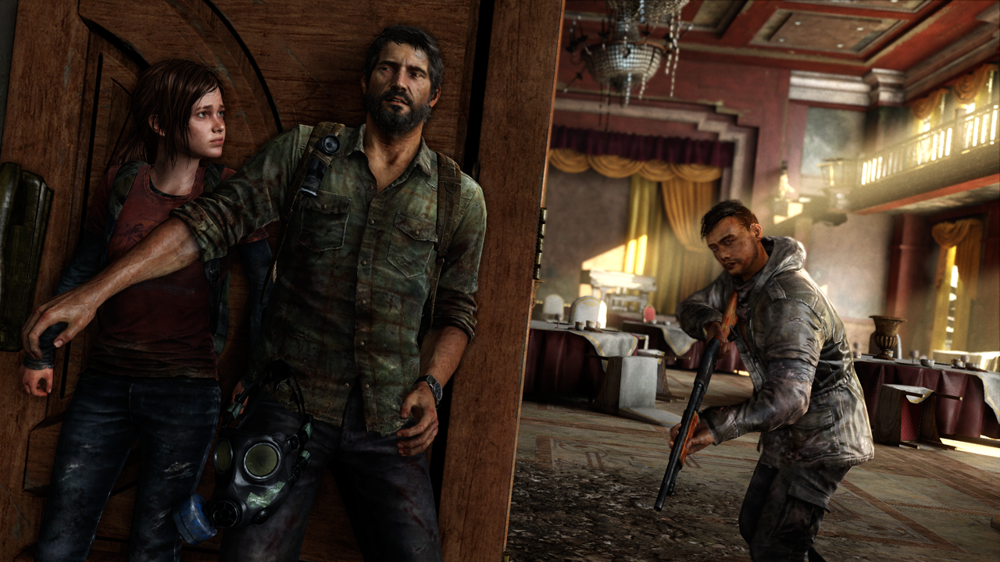
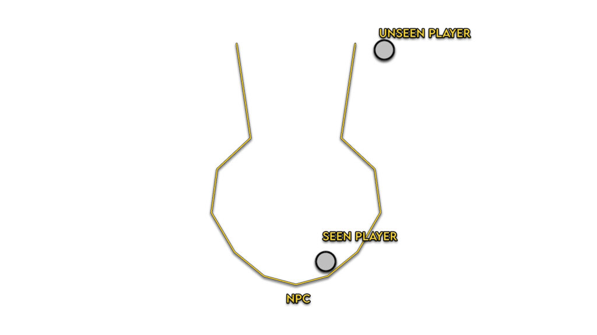
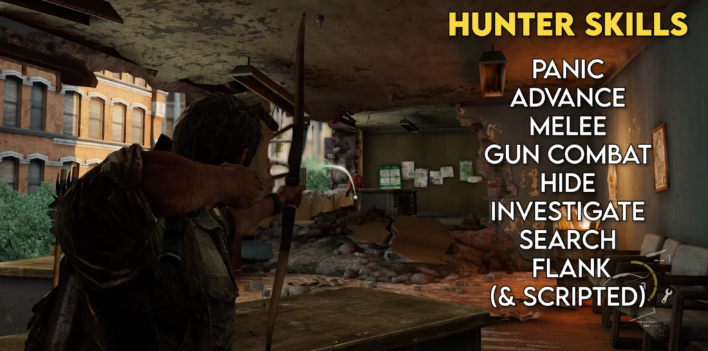
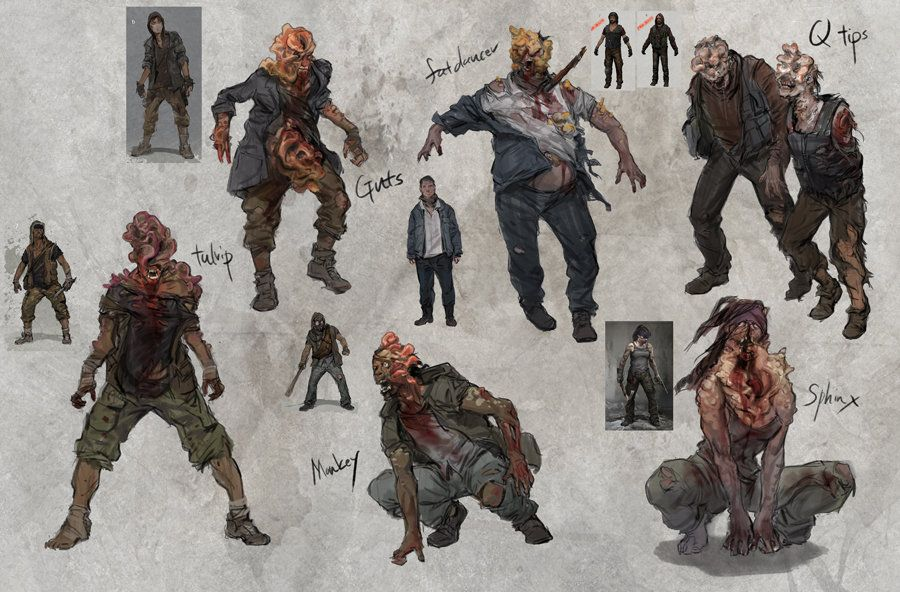
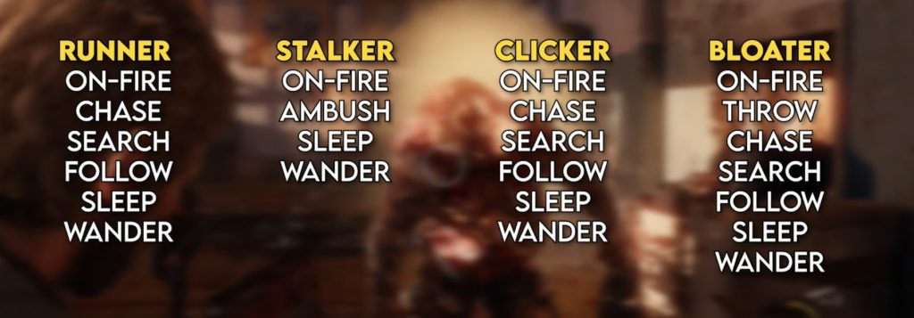
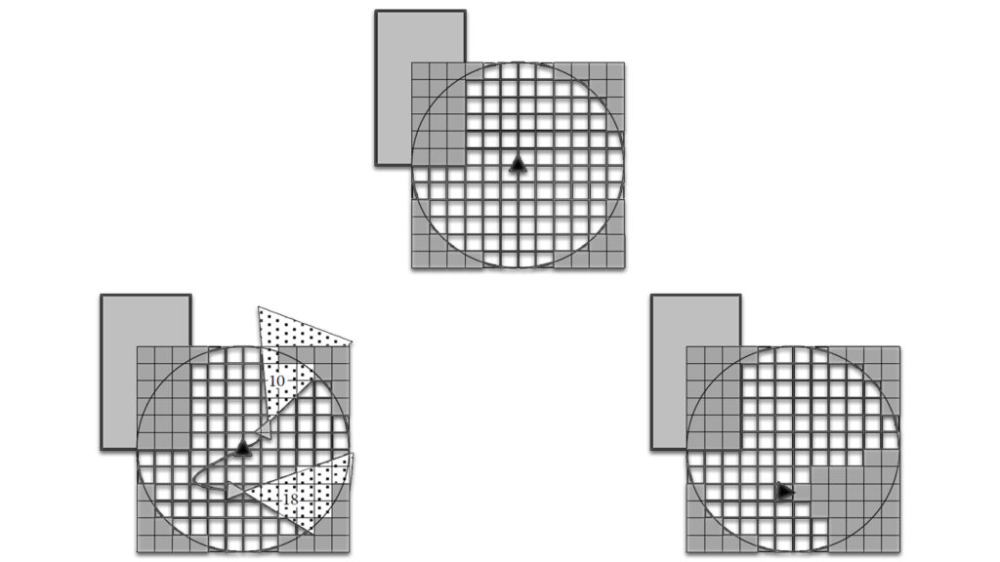
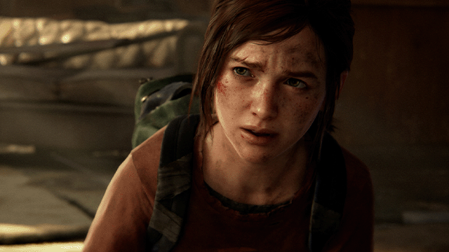
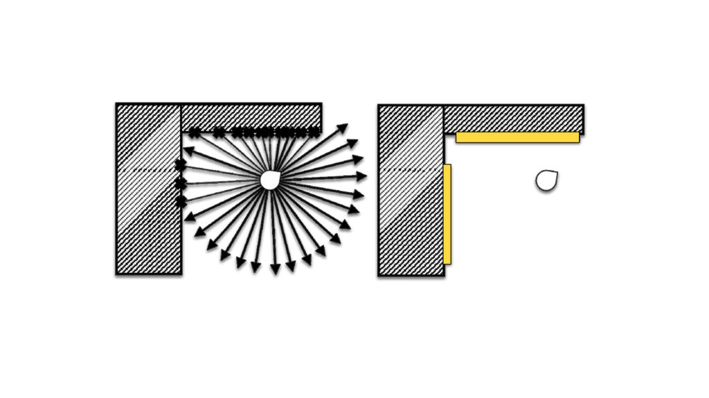

# Case Study: The Last of Us

## The Last of Us
The Last of Us is a 2013 action-adventure-survivor videogame developed by Naughty Dog. There are two chapter of the game:
- The Last of Us 1
- The Last of Us 2

There is also a DLC that goes deep in the life of *Ellie*, one of the character in the game that walk with *Joel*: the main character of the game. 

The Last of Us is one of the most renowned game probably that always been published, not only for his story, but also for his gameplay and for the Artificial Intelligence used for the development.

|  |
|:--:|
| <b>Image Credits: HDBlog.it</b>|

## Artificial Intelligence in The Last of Us
Before starting with a more concrete explain of how the different AI character are used in the game, it is good to introduce some theory about what is actually implemented.

The Last of Us is built using **Finite State Machines (FSMs)**. What are FSMs? They are state triggered by an event, so is an event is not happening potentially the character could do the same thing all over again. This is an important introduction for what we are going to see later.

|  |
|:--:|
| <b>Image Credits: AI and Games</b>|

Now, let's talk about the AI of The Last Of Us. It is build using **skills and behaviours**, not only for the characters we play, but also (and most importantly) for the enemies. 

The image above shows us `Move to Location <-> Play animation` and it is the exact definition for **skills**. This, even if could appear as a basic paradigm, allows the enemy to inspect the area until the player shows up. When the enemy shows up, it plays a **trigger event** and the enemies start to attack or hide from the player. 

In few words, the actions seems pretty basilar; yet they give us the idea of how a small feature can makes us see how smart the game-world could be.

About the **behaviours**, instead, we are talking about something that every user applies different: a user can do a melee attack or stay distant from the enemy. Behaviours are then *specific concrete actions* that make the enemies understand of we want to approach them.

|  |
|:--:|
| <b>Image Credits: HDBlog.it</b>|

Then what are the states of the *Finite State machines*? Actually, each skills contains a finite state machine that determines an animation or another event. Of course since they are **finite**, it is not possible to do something that the game does not allow, but there are plenty of different skills and behaviours that are possible to approach, and yet they do not overwhelm the player, in order to give a fantastic game experience.

## Enemies
There are two different type of enemies:
- hunters (human enemies)
- infected (zombie enemies)
  
Let's start our discussion with the human ones.

### Hunters
They are designed to appear as a credible threat of course. They can easily kill you if the difficult is hard enough. They also appear coordinated with the other hunters in the game, to find a way to hunt you down and eliminate the player: basically they act like an Artificial Intelligence version of you!

The most important thing is that the hunters can detect you in the world, both with vision and with audio. 

This is a very basic pseudocode that should probably explain how the whole enemy system works. 

```
while (skill is not happened):
    move around the map
if skill happened -> attack Joel
    is Joel hiding? 
        hide yourself and look for him
    is Joel shooting?
        find a cover
    is Joel running towards you?
        prepare a counter-attack
```
But how is actually implemented?

|  |
|:--:|
| <b>Image Credits: Game Developer</b>|

The Last of Us uses a *cone* that allow the player to be seen by enemies after typically 1 or 2 seconds. Very similar techniques are used in games such as *Splinter Cell and Uncharted*. In addition to that, enemies also scan the near environment, to understand if there is something standing between them and *Joel* (such as Anomaly Detection algorithms). Originally a enemy would have run in Joel's direction without scanning his nearest environment. Eventually, if *Joel* is spotted, the enemy aims to the chest or to the head.
These are the skills of the hunters:

|  |
|:--:|
| <b>Image Credits: Game Developer</b>|

One of the most interesting is the **investigation**, behaviour used when a Hunter is looking for *Joel* after a sound such as a breaking bottle or a brick (Joel's behaviour vs enemy's behaviour). **Search**, on the other hand, is when the player has been detected and Hunter already knows that he is nearby. These behaviour rely on four key components:
- **Combat Coordination System:** gives roles to each character, deciding which behaviour to execute. 
- **Navigation Map**: shows the fastest way to navigate around the world. This show to the NPC a path to look for *Joel*.
- **Exposure Map**: sits on top of the navigation map that shows information about what the NPC can see from his current position. This shows to the NPC what is nearby.
- **Cover Point System**: identifies not only good covers but also specific animation and behaviours. This is called by the NPC to understand where *Joel* could be. 

|  |
|:--:|
| <b>Image Credits: Game Developer</b>|

In this case, the NPC will move in the white spaces. Once the enemy is spotted, depending on the behaviour of Joel, the enemy will fight you or shoot you, covering behind one of the black spaces (*Cover Point System*), he is able to find the best cover to make *Joel* in difficult, based on his position.
The enemy can also decide to stand and shoot you, for example, or to approach you. This is decided by the *Combat Coordinator System*

### The Infected

|  |
|:--:|
| <b>Image Credits: Pinterest</b>|

In the case of the infected, they are more likely to do melee attacks. On the other hand, their emphasis on sound in much more efficient than the human one. It is significant to say that there are different types of infected:

|  |
|:--:|
| <b>Image Credits: Pinterest</b>|

The **clickers** specially can hear sound even through walls and start the **search** phase. Clickers tho, can't see, so it is possible to apply behaviour that kills them immediately, such as a shot in the head or a molotov. Of course is much more difficult because of the their great reaction to sounds. 
Since we are talking about one of the clickers' skills, let's see that other they can do. 

Infected share some skills, such as **sleeping, wander, search, on fire**. The last one is the number one skill of an infected. 
The **Wander** instead is the last skill, in order of priority: they are allowed to move randomly and interact with the map (**throw**), but they manintain a history of the effectuated paths, so that they do not come back on the same one, on the other hand if they go for a walk to distance from Joel, they can start the **sleep** phase again, making much more easier for *Joel* to kill the enemies.

Now, let's focus again on the sounds. How do characters such as the **Clicker** and the **Runner** search for the player if they hear something nearby? Infected do not search as hunters. They are less methodical and try to run towards the source of the sound. They stand for some seconds against the source of impact and then start a **search** path.

|  |
|:--:|
| <b>Image Credits: Game Developer</b>|

The infected provide also a completely different combat experience from the Hunters because they can't shoot. So most of the time, their approach is to try and run to attack *Joel*. Also, Infected do not have any ability to communicate with one another (the Hunters can), but you might have noticed they sometimes follow each other, either while exploring disturbances or attacking the player.

## Ellie

|  |
|:--:|
| <b>Image Credits: SpazioGames</b>|

Now, for Ellie the discussion is quite different. She has to follow four guidelines:
- Ensuring she stays close to Joel at all times, and finding points in the world that make sense to do so.
- Giving her useful a sense of utility, be it to identify or attack enemies.
- Making Ellie interesting as a character, given her special animations and audio dialogue.
- And lastly ensuring the authenticity of the experience, by preventing her AI from cheating.

All the work she does, is because of her ability to have a very specific and good positioning. 

|  |
|:--:|
| <b>Image Credits: Ellie: Buddy AI in The Last of Us, Max Dyckhoff, Game AI Pro Vol. 2, chapter 35, 2015</b>|

Ellie searches for the better cover position and follows Joel. Now, when Ellie is hidden, she generates a **cover action packs** typically used for environmental interactions by the player, such as a suggestion or some ammo. Two animations that are very frequently used are:
- Following in the cover
- Protected in cover

|  |
|:--:|
| <b>Image Credits: Ellie: Buddy AI in The Last of Us</b>|

When eventually she has a gun, she only uses if the player is not, trying to save him if he is in danger. If you survive and kill some enemies, she will stop using it. Basically Ellie's AI does not cheat and tries to give the user most of the work, supporting him when is necessary. Reason why her character is full of "funny" dialogs.

## Closing
I truly hope that this was great for you as much as it was for me, stAI tuned for other curiosities about video games world! Thank you for reading that.
